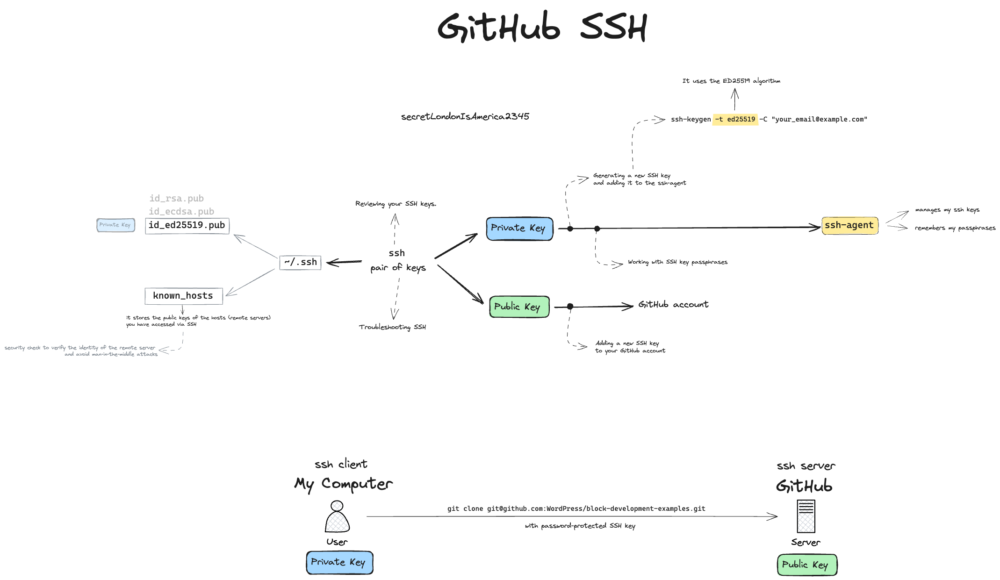

# SSH in GitHub



## Generating a new SSH key

```
⬢ ssh-keygen -t ed25519 -C "juanma.garrido@gmail.com"
Generating public/private ed25519 key pair.
Enter file in which to save the key (/Users/juanmanuelgarrido/.ssh/id_ed25519):
Enter passphrase (empty for no passphrase):
Enter same passphrase again:
Your identification has been saved in /Users/juanmanuelgarrido/.ssh/id_ed25519
Your public key has been saved in /Users/juanmanuelgarrido/.ssh/id_ed25519.pub
The key fingerprint is:
SHA256:QwIBIZFKE0wUZiJrrlLDl5NekXGO8eEXvIB/cfU0/XM juanma.garrido@gmail.com
The key's randomart image is:
+--[ED25519 256]--+
|xxxxxxxxxxxxxxxxx|
|ooooooooooooooooo|
|+++++++++++++++++|
|.................|
|                 |
|                 |
|                 |
|                 |
|                 |
+----[SHA256]-----+
```

This generates a pair of files for the SSH (`id_ed25519` for the private key and `id_ed25519.pub` for the public key)

## Adding your SSH key to the ssh-agent

Start the `ssh-agent` in the background

```
⬢ eval "$(ssh-agent -s)"
Agent pid 23623
```

For Mac -   Modify your `~/.ssh/config` file to automatically load keys into the ssh-agent and store passphrases in your keychain.

```
⬢ open ~/.ssh/config
The file /Users/juanmanuelgarrido/.ssh/config does not exist.
⬢ touch ~/.ssh/config
⬢ vi config
```

And add...

```text
Host github.com
  AddKeysToAgent yes
  UseKeychain yes
  IdentityFile ~/.ssh/id_ed25519
```

_`UseKeychain`  = `yes` - to add the paraphrase_

Add your SSH private key to the ssh-agent and store your passphrase in the keychain

```shell
⬢ ssh-add --apple-use-keychain ~/.ssh/id_ed25519
Enter passphrase for /Users/juanmanuelgarrido/.ssh/id_ed25519:
Identity added: /Users/juanmanuelgarrido/.ssh/id_ed25519 (juanma.garrido@gmail.com)
```

_`--apple-use-keychain` - to also store the paraphrase_

## Using `ssh` connection 

After adding public key to github.com according to [Adding a new SSH key to your GitHub account](https://docs.github.com/en/authentication/connecting-to-github-with-ssh/adding-a-new-ssh-key-to-your-github-account)

```
⬢ git clone git@github.com:WordPress/block-development-examples.git
Cloning into 'block-development-examples'...
The authenticity of host 'github.com (20.26.156.215)' can't be established.
ED25519 key fingerprint is SHA256:+DiY3wvvV6TuJJhbpZisF/zLDA0zPMSvHdkr4UvCOqU.
This key is not known by any other names.
Are you sure you want to continue connecting (yes/no/[fingerprint])? yes
Warning: Permanently added 'github.com' (ED25519) to the list of known hosts.
remote: Enumerating objects: 10704, done.
remote: Counting objects: 100% (3350/3350), done.
remote: Compressing objects: 100% (708/708), done.
remote: Total 10704 (delta 2738), reused 3188 (delta 2619), pack-reused 7354
Receiving objects: 100% (10704/10704), 38.16 MiB | 7.90 MiB/s, done.
Resolving deltas: 100% (8264/8264), done.
```

 `known_hosts`
 
```
github.com ssh-ed25519 AAAAC3NNTE....kWi9GKJl
github.com ssh-rsa AAAAB2EA...y6v0mKV0Upockg=
```


## `known_hosts` 


The `known_hosts` file is a vital part of the SSH client configuration files. ==It is used to store the public keys of the hosts (remote servers) you have accessed via SSH.== This file helps in avoiding man-in-the-middle attacks by verifying the identity of the remote server.

When you connect to a new remote server via SSH, you are prompted whether you want to add the remote host to the `known_hosts` file. If you say yes, the identity of the server is saved to your system.

The `known_hosts` file is created in the `.ssh` directory of your home directory. You can see its contents using the command `ls -l .ssh`. The file contains one entry per host, with the format being `hostname,IP address,public key`.

Here’s an example of a `known_hosts` file:

```
# Commentary lines start with a '#'
# A line with a '#' at the beginning is considered a comment.

# Example 1: A host with a RSA key
foo.com,107.180.00.00 ssh-rsa

# Example 2: A host with an ED25519 key
bar.com,192.168.1.100 ed25519
```

To add a host to the `known_hosts` file, you can manually edit the file or use the `ssh` command with the `-o` option followed by `StrictHostKeyChecking=yes`.

For example:

```
ssh -o "StrictHostKeyChecking=yes" user@foo.com
```

This will prompt you to add the remote host to the `known_hosts` file.

It’s important to note that the `known_hosts` file is not the same as the `authorized_keys` file. The `authorized_keys` file is used to store the public keys of the users who are allowed to connect to your server, while ==the `known_hosts` file is used to store the public keys of the remote servers you have accessed==.

In summary, the `known_hosts` file is an essential part of the SSH client configuration files that helps in verifying the identity of remote servers and preventing man-in-the-middle attacks.